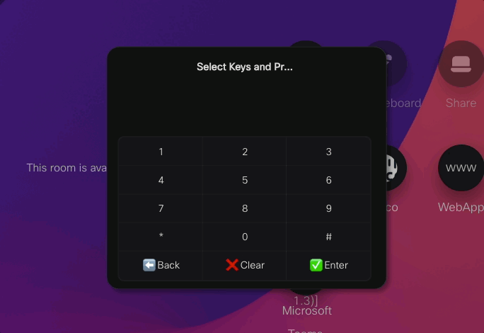

# Keypad Confirm Macro

A Cisco RoomOS macro that replaces the default in-call keypad with a confirmation-style keypad UI.

## What It Does

- Intercepts keypad input and builds a visible DTMF sequence first
- Prevents immediate DTMF transmission on key press
- Sends the full sequence only when Enter is selected
- Supports Back and Clear controls before sending
- Clears the sequence when the keypad page is closed
- Closes the keypad automatically after a successful send
- Displays a blinking cursor in the text area to indicate editable input

## File

- `DTMF-Confirmation.js`: Complete macro implementation

## Install

1. Open your RoomOS Macro Editor.
2. Create a new macro and paste in `DTMF-Confirmation.js`.
3. Save and activate the macro.

## Usage

1. Start or join a call.
2. Open **Keypad** from Call Controls.
3. Enter digits (`0-9`, `*`, `#`) into the custom keypad.
4. Use **Back** or **Clear** as needed.
5. Press **Enter** to send the full DTMF sequence.

## Notes

- The native call keypad is hidden while this macro is active.
- A keypad tone is played for each key release.
- The panel closes when there are no active calls.